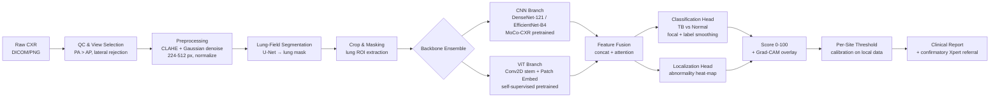
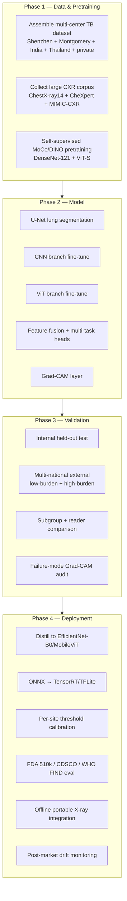

# A Clinically Usable Deep-Learning System for Pulmonary TB Detection from Chest X-rays

## Executive Recommendation

For a clinically deployable TB screening model that meets the WHO Target Product Profile (TPP) for triage — **≥90% sensitivity at ≥70% specificity** — the best-supported architecture is a **hybrid two-stage ensemble** built on self-supervised CXR pretraining:

> **U-Net lung-field segmentation → CNN branch (DenseNet-121 or EfficientNet-B4) + Vision Transformer branch with a Conv2D stem → late feature fusion → multi-task heads (TB classification + abnormality heat-map) → Grad-CAM interpretability layer → per-site threshold calibration.**

This design draws on three converging lines of evidence: (1) CheXNet-style DenseNet-121 remains the most externally validated backbone for thoracic disease classification and was the architecture used in the WHO-eligible CAD4TB lineage; (2) EfficientNet-B4 has shown the strongest single-model performance on TB-specific manifestations, with AUC 0.95–1.0 and Grad-CAM localization across geographical external test sets; and (3) a CNN+ViT ensemble with deep-layer aggregation currently holds SOTA on the Shenzhen benchmark (AUC 0.98, 99% sensitivity / 94% specificity), with radiologist-confirmed clinical relevance. Crucially, a 2026 multi-national external validation study demonstrated that *any* single-source TB model is unsafe without multi-center training and local calibration — a DenseNet-121 trained on Shenzhen collapsed to 52.3% sensitivity on an Indian cohort and 43.7% specificity on a US cohort. The pipeline below is engineered around that reality.

---

## End-to-End Pipeline Overview

The remainder of this document justifies each block.

---

## Architecture Comparison

| Backbone | Family | Params (~M) | Typical TB AUC | Strengths | Weaknesses | Clinical Fit |
| --- | --- | --- | --- | --- | --- | --- |
| **DenseNet-121** (CheXNet) | Dense CNN | ~8 | 0.89–0.99 | Most externally validated; strong transfer from CheXpert/MIMIC; cheap inference | Older; lower capacity than EfficientNet | ★★★★★ Workhorse, recommended CNN branch |
| **EfficientNet-B4** | Compound-scaled CNN | ~19 | 0.95–1.0 | Best single-model AUC on TB manifestations; strong Grad-CAM localization | Heavier; sensitive to input resolution | ★★★★★ Recommended CNN branch (alt.) |
| **Vision Transformer (ViT, Conv-stem)** | Transformer | ~25–86 | 0.95–0.99 | Global context; self-attention captures diffuse TB patterns; self-supervised pretraining boosts pediatric zero-shot | Data-hungry; needs CNN stem for medical imaging | ★★★★ Recommended ViT branch |
| **Hybrid CNN+ViT** (GhostNet+MobileViT, HyCoViT, SqueezeViT) | Hybrid | 3–10 | 0.97–0.99 | Accuracy–efficiency trade-off for edge deployment | Less externally validated; complex training | ★★★★ Edge/portable X-ray use case |
| **Conv-Autoencoder + Multi-Scale CNN ensemble** | Ensemble | varies | **0.98** (SOTA Shenzhen) | 99% sens / 94% spec; radiologist-validated | Compute-heavy; opaque internals | ★★★★ Reference SOTA ensemble |
| **ResNet-50 / Inception-V3 / VGG-16** | Classic CNN | 25–138 | 0.90–0.97 | Familiar, well-tooled | Outperformed by DenseNet/EfficientNet on TB benchmarks | ★★ Baseline only |
| **Vision Mamba** | State-space | varies | n/a (active vs inactive) | Promising for active/inactive TB distinction | Very early; no external validation | ★★ Research only |

**Verdict:** No single architecture dominates on all axes. The clinically safest design fuses a CNN (local texture — cavitations, nodules, consolidations) with a ViT (global context — bilateral distribution, apical predominance), which is exactly the pattern emerging across 2024–2026 SOTA work.

---

## Module 1 — Data Strategy

**Datasets to combine for training (multi-center is non-negotiable):**

| Dataset | Source | Size | Notes |
| --- | --- | --- | --- |
| **Shenzhen** | China, NIH | 662 (336 TB / 326 normal) | Most common benchmark; AP/PA mixed |
| **Montgomery** | USA, NIH | 138 (58 TB / 80 normal) | Low-burden, high-resource; different scanner profile |
| **NIH ChestX-ray14** | USA | ~112,000 | 14-class labels incl. effusion/consolidation/infiltration — useful for pretraining and negative mining |
| **CheXpert / MIMIC-CXR** | USA | ~224k / 377k | Large-scale weakly labeled; best self-supervised pretraining corpus |
| **Songklanagarind** | Thailand | private | Used in the Nature 2026 ensemble; adds SE-Asia representation |
| **India TB cohort** | India | 155 TB+ | Critical for high-burden domain coverage |
| **Pediatric CXR** | Various | varies | Needed if <15y indication is pursued (WHO does not yet endorse CAD for children) |

**Labeling protocol.** Use radiologist-adjudicated labels (≥2 readers, senior arbitration) with microbiological reference (Xpert MTB/RIF or culture) where available. For pretraining corpora with weak labels, use noisy-label-robust losses. **Active vs inactive TB** should be a secondary label where possible — clinically critical but radiologically subtle.

**Class imbalance handling.** TB prevalence in screening populations is 1–10%, so:

- Stratified sampling + weighted sampler
- Focal loss (γ=2) or asymmetric loss rather than plain BCE
- Consider generative augmentation (GAN/ChexGen) for rare manifestations — ChexGen is a purpose-built chest-radiography generative foundation model for synthetic augmentation
- **Do not use horizontal flipping** — it produces anatomically implausible CXRs and was explicitly identified as harmful in the multi-national validation study

---

## Module 2 — Preprocessing Pipeline

This is where most "model" gains actually come from in CXR work.

1. **DICOM decoding & view selection.** Extract PixelData, apply ModalityLUT + VOILUT, convert to 8-bit. Prefer **PA** views; if only AP available, tag it as a covariate (AP shifts score calibration). Reject laterals.
2. **Quality control.** Reject rotated/underexposed/cropped images automatically (a lightweight QC CNN or heuristic on lung-field area).
3. **Lung-field segmentation.** U-Net trained on JSRT/MS-CXR masks; with **CLAHE preprocessing** it reaches Dice ≈ 0.96, Pixel Accuracy 97.96% on Shenzhen/Montgomery. The mask is used to crop the lung ROI and to suppress extra-thoracic artifacts (text, jewelry, pacemakers) that otherwise become shortcut features.
4. **Contrast enhancement.** CLAHE (clip limit 2.0–3.0, tile 8×8) is the single most-cited preprocessing step for TB CXR; combined with mild Gaussian blur denoising it is the standard ViT preprocessing recipe.
5. **Resizing.** 224×224 for ImageNet-pretrained branches; 320×320 or 384×384 for EfficientNet-B4 / ViT to preserve subtle texture (cavitations are <30 px at 224).
6. **Normalization & augmentation.** ImageNet stats or per-dataset stats; augment with small rotations (±10°), translation, scale, brightness/contrast jitter, **CutMix** (within lung field), and **MixUp**. Exclude flips.

---

## Module 3 — Architecture Design (Recommended)

### Branch A: CNN backbone

- **DenseNet-121** (CheXNet configuration): 121-layer dense connectivity, 121 composite layers, growth rate 32, reduction 0.5; final GAP → FC → sigmoid. Initialize from **MoCo-CXR** self-supervised pretraining (not raw ImageNet) — MoCo-CXR pretraining demonstrably improves representation and cross-dataset transferability on CXR tasks including TB.
- **Alternative: EfficientNet-B4** if you need higher capacity and can afford ~19M params. B4 achieved AUC 0.95–1.0 across individual TB manifestations (cavitation, consolidation, pleural effusion, etc.) on intramural and geographically external test sets, with the strongest Grad-CAM localization among CNNs.

### Branch B: Vision Transformer

- ViT-S/16 or Swin-Tiny with a **Conv2D stem** (3–4 conv layers) replacing the patch-embed linear projection — this is the modification that makes ViTs work on medical images, since pure patch embedding discards local texture that CNNs exploit.
- Initialize from a self-supervised CXR-pretrained ViT (zero-shot pediatric TB work confirms self-supervised ViT pretraining beats fully supervised for TB).

### Fusion

- **Late fusion with attention:** GAP each branch's penultimate feature map → concatenate → 1-layer attention gating → final classifier. This mirrors the GhostNet+MobileViT fusion that achieved the best accuracy-efficiency trade-off.
- For higher performance at compute cost, use the **deep-layer aggregation** pattern from the Nature 2026 SOTA ensemble (Conv-Autoencoder for reconstruction-regularized features + multi-scale CNN).

### Multi-task heads

- **Head 1 (primary):** TB vs Normal binary classification with focal loss + label smoothing (ε=0.1).
- **Head 2 (auxiliary):** Abnormality localization — weakly supervised multi-label head for TB-relevant findings (cavitation, consolidation, pleural effusion, hilar lymphadenopathy, fibrosis, nodules). This forces the backbone to learn pathologically meaningful features rather than shortcuts, and supplies the Grad-CAM heatmap.
- **Head 3 (optional):** Active vs inactive TB classification where labels exist — clinically important for treatment decisions.

### Interpretability layer

- **Grad-CAM** (or Grad-CAM++) overlaid on the original CXR for every positive prediction. This is mandatory for clinical trust and is the standard across all WHO-evaluated CAD products (CAD4TB produces an abnormality heatmap by design).
- For latency-critical edge deployment, consider the **principal-component-based CAM** variant: 98.2% sensitivity, 99.4% specificity, and 0.10 ms inference vs 4.1 ms for VGG16-based Grad-CAM.
- Every heatmap should be human-readable and constrained to the lung field (use the U-Net mask) to avoid highlighting spurious regions.

---

## Module 4 — Training Strategy

**Stage 1: Self-supervised pretraining.** Run MoCo-v3 or DINO on the union of ChestX-ray14 + CheXpert + MIMIC-CXR (no TB labels needed). This produces a CXR-specialized backbone that transfers better than ImageNet — confirmed by MoCo-CXR and by the MUSCLE multi-task self-supervised continual-learning pipeline that explicitly pretrains on TB detection, lung segmentation, and skeletal abnormality simultaneously.

**Stage 2: Multi-task supervised fine-tuning on TB data.**

- Two-phase: (a) freeze backbone, train heads only (1–3 epochs); (b) unfreeze, fine-tune all layers with discriminative learning rates (backbone 1e-5, heads 1e-3).
- Optimizer: AdamW, cosine LR schedule with warmup (5 epochs), weight decay 1e-4.
- Batch size 32–64 (or gradient accumulation); mixed-precision (fp16).
- Early stopping on validation AUC, not loss.
- **Loss:** `L = α·focal(cls) + β·BCE(multi-label findings) + γ·KL(active/inactive)` with α=1.0, β=0.3, γ=0.2 as a starting point.

**Stage 3: Ensemble distillation.** Train the ensemble, then distill into a single EfficientNet-B0/B2 or MobileViT for edge deployment if needed — preserves ~95% of ensemble AUC at <5M params.

**Stage 4: Per-site calibration.** The single most important — and most often skipped — step. After deployment-site data (even 50–200 locally labeled CXRs) is collected, recalibrate the score threshold so that the operating point hits ≥90% sensitivity *on that site's data*. CAD4TB v5/v6/v7 require different triaging thresholds across sites, and ignoring this is a known safety hazard.

---

## Module 5 — Evaluation Protocol

**Primary metric:** AUC-ROC and, at the ≥90%-sensitivity operating point, **specificity** (this is the WHO TPP framing).

**Minimum reporting:**

- Sensitivity, specificity, PPV, NPV at the chosen threshold (with 95% CIs)
- AUC-ROC and AUC-PR (TB is rare; PR is more honest)
- F1, Matthews correlation coefficient
- Calibration: Brier score, reliability diagrams, Expected Calibration Error

**Evaluation structure (mandatory):**

1. **Internal held-out test set** (same centers, never seen in training)
2. **Multi-national external validation** — at minimum one low-burden high-resource site (e.g., Montgomery-like) and one high-burden site (India/SE-Asia/Sub-Saharan Africa). The 2026 multi-national study is the template: it revealed that a Shenzhen-trained DenseNet-121 had AUC 0.889 internally but specificity collapsed to 43.7% in the USA and sensitivity collapsed to 52.3% in India.
3. **Subgroup analysis:** HIV status, age bands, sex, prior TB, diabetes, AP vs PA view, scanner manufacturer, portable vs fixed unit.
4. **Reader comparison:** head-to-head with ≥3 radiologists and ≥3 clinical officers (the actual end-users in high-burden settings) on the same blinded test set.
5. **Failure-mode analysis:** Grad-CAM review of all false negatives by a senior radiologist — these are the clinically dangerous errors.

**WHO TPP target (triage):** ≥90% sensitivity at ≥70% specificity is the minimum acceptable bar; CAD4TB achieved 73.8% specificity at 90% sensitivity in the multi-country study that informed WHO's 2025 recommendation. Treat this as the floor, not the goal.

---

## Module 6 — Clinical Deployment

**Regulatory pathway.** Treat the model as **Software as a Medical Device (SaMD)**. In the US, the FDA 510(k) pathway (median clearance ~142 days for AI/ML devices) is viable if a predicate exists; De Novo (~10–11 months) or PMA for novel indications. In the EU, MDR Class IIa/IIb. In India, CDSCO. WHO's June 2025 approval of six CAD products (including CAD4TB, qXR, and Genki/DeepTek) establishes the regulatory template — independent FIND-validated evaluation against WHO TPP is now the de facto global standard.

**Deployment stack for resource-limited settings:**

- Export model to **ONNX**, then optimize to **TensorRT** (NVIDIA Jetson) or **TFLite** (ARM CPU) for on-device inference. ONNX Runtime is the cross-platform default; TensorRT gives the best GPU latency; TFLite wins on battery/ARM.
- Target **<1 second inference** on a mid-range laptop GPU or Jetson Orin Nano — easily achievable for a distilled EfficientNet-B0 + small ViT ensemble.
- **Offline-first architecture:** ultra-portable X-ray units (e.g., Delft UPDX) with embedded CAD operate without internet in remote areas — this is the proven CAD4TB deployment model in Nigeria and elsewhere.
- Output: a **0–100 risk score** (matching CAD4TB's clinically familiar scale) + heatmap overlay + a binary triage decision at the site-calibrated threshold + mandatory referral for **confirmatory Xpert MTB/RIF testing** before treatment initiation (WHO is explicit that CAD is a triage, not diagnostic, test).

**Post-market surveillance.** Continuous monitoring of sensitivity/specificity drift, re-calibration quarterly, and re-training triggers when input distribution shifts (new scanner, new population).

---

## Common Pitfalls (and how the recommended pipeline avoids them)

| Pitfall | Why it happens | Mitigation in this design |
| --- | --- | --- |
| **Domain-shift collapse** (sensitivity drops 40+ points on new geography) | Single-source training; model learns scanner/site shortcuts | Multi-center training + per-site calibration + lung masking removes extra-thoramic shortcuts |
| **False-positive surge** in low-burden settings | Scanner "haze" interpreted as opacity | CLAHE normalization + U-Net lung cropping + scanner as covariate |
| **Shortcut learning** (model keys on text/view markers) | Weak labels, irrelevant image regions | Lung-field masking + multi-task findings head + Grad-CAM audit |
| **Anatomically impossible augmentation** | Reflexive horizontal flip | Explicit flip exclusion |
| **Score drift after software update** | Silent backbone changes | Versioned models, threshold re-calibration on every update |
| **Overfitting to small TB datasets** | Shenzhen/Montgomery are tiny (662/138) | Self-supervised CXR pretraining on 700k+ images before TB fine-tuning |
| **Missing active/inactive distinction** | Binary TB-vs-normal heads | Add active/inactive auxiliary head |
| **Uninterpretable outputs** | Black-box classifier | Grad-CAM on every positive, lung-constrained, radiologist-audited |
| **Pediatric deployment** | WHO does not yet endorse CAD <15y | Either exclude <15y or build a dedicated pediatric model with self-supervised ViT (zero-shot pediatric TB is feasible) |

---

## Implementation Checklist

**Minimum viable spec to hit WHO TPP:**

- DenseNet-121 (MoCo-CXR pretrained) + Conv-stem ViT-S ensemble, lung-masked input, focal loss, Grad-CAM, trained on ≥4 geographic centers, externally validated on ≥2 unseen countries, threshold-calibrated per site, distilled to ONNX/TFLite for ≤1 s inference on edge hardware.

This is the architecture and pipeline that the current research literature — from CheXNet (2017) through the Nature 2026 ensemble and the 2026 multi-national domain-shift study — converges on as both the highest-performing and the clinically safest option for TB screening from chest X-ray.
